1、打开[Github](https://www.github.com) 登陆你的账号或者注册一个新的账号。
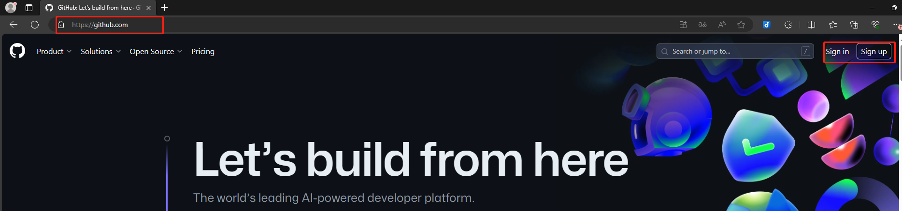

2、打开[ego62固件存储库](https://github.com/egokb/zmk-config-ego62) 并点击Fork
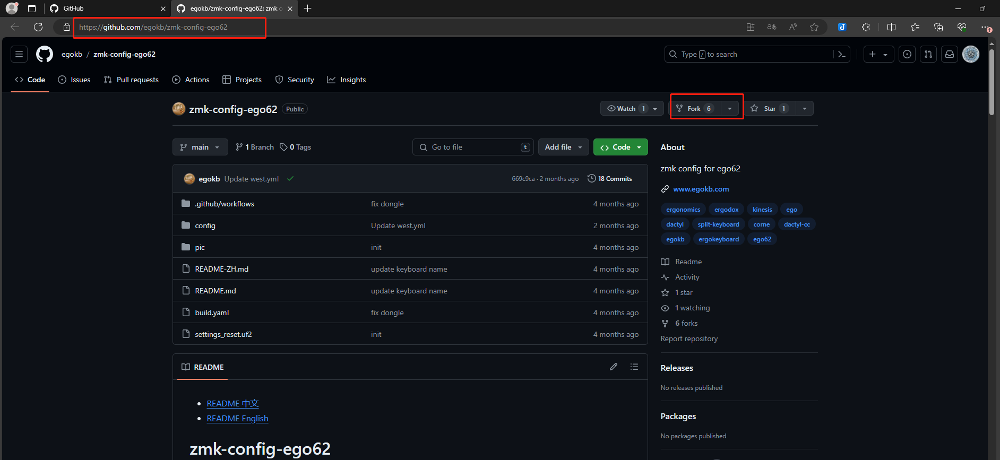
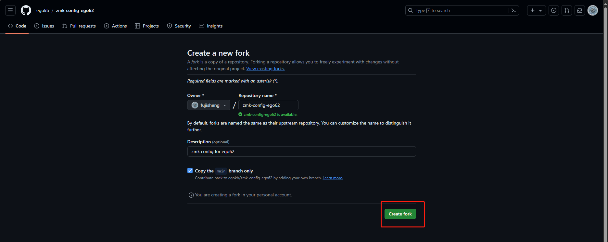

3、点击Fork的仓库的Actions，点击按钮启用Action
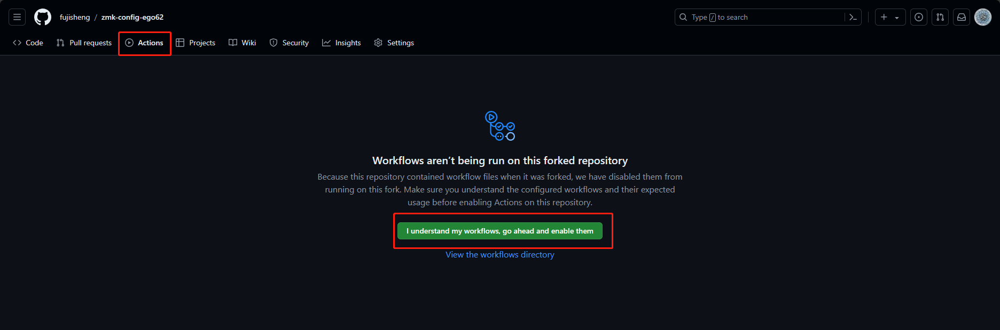

4、回到仓库主页点击下方的图形编辑链接
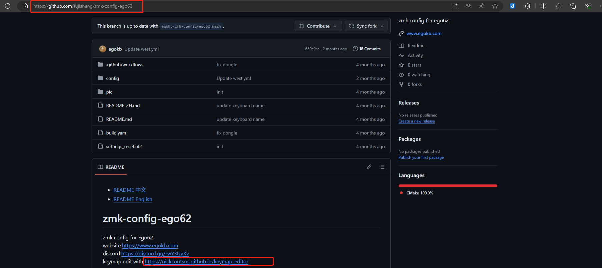

5、点击按钮选择权限
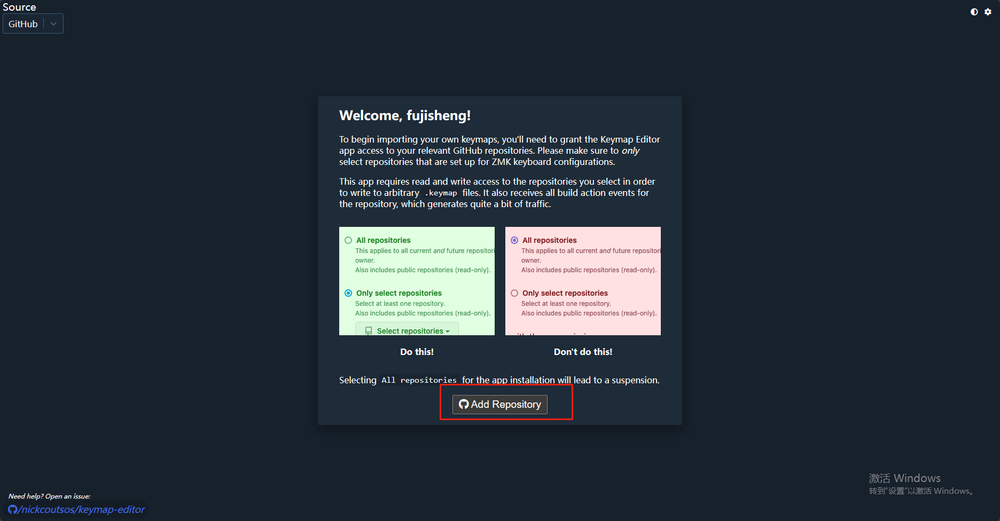
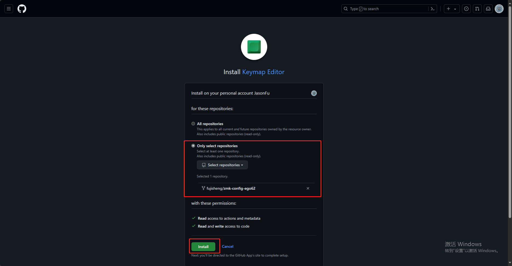

6、编辑你所需要的按键
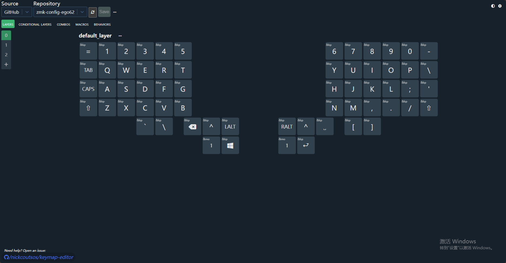

7、点击保存按钮等待编译
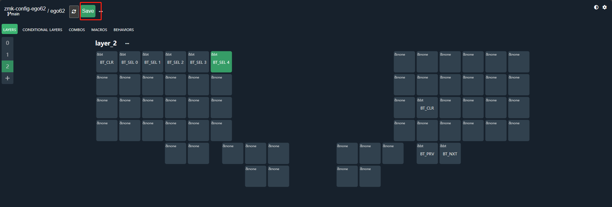
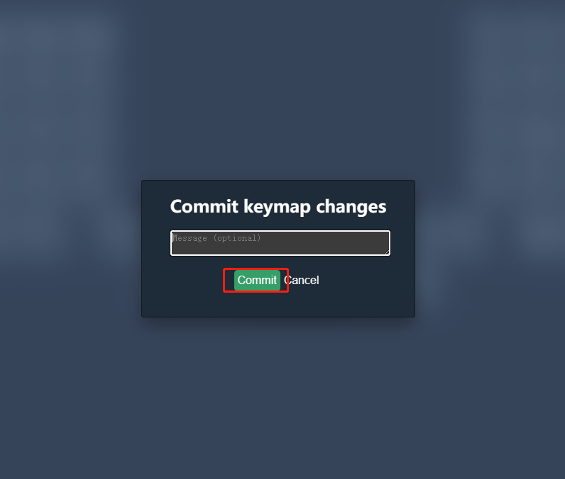
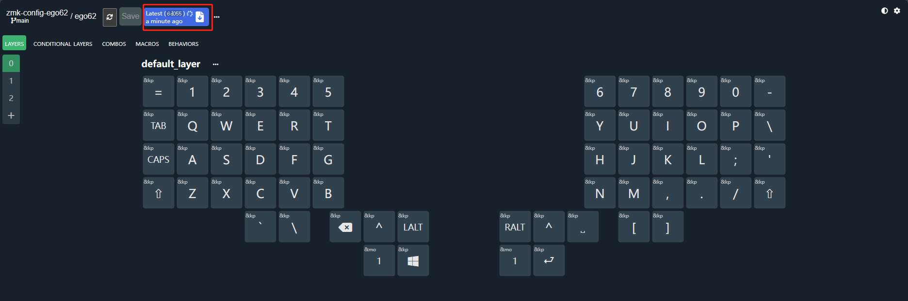

8、约5分钟后点击下载固件按钮跳转到你的仓库的action页面

9、点击下载按钮下载编译好的固件并解压
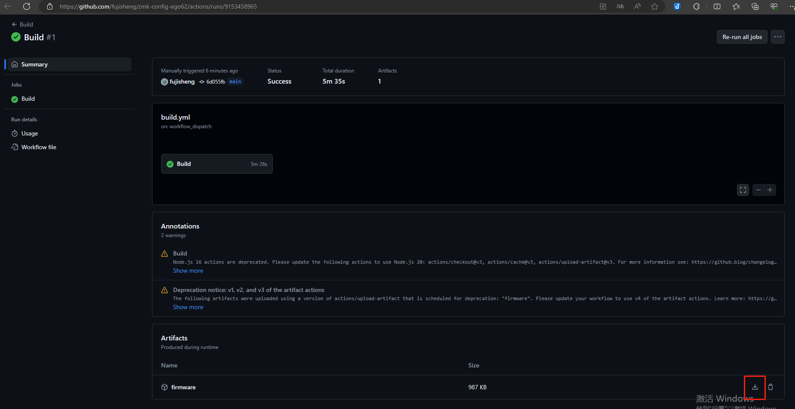
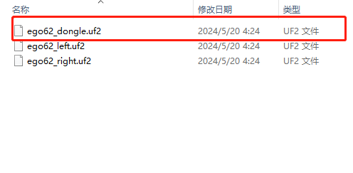

10、双击接收器后面的按钮会在文件管理器中出现一个U盘

11、将带dongle后缀的文件复制到这个U盘中，如出现报错跳过即可

12、这个U盘将会消失，等待约5秒固件重启即可

如果是第二次修改重复以上4、6、7-10步骤即可
